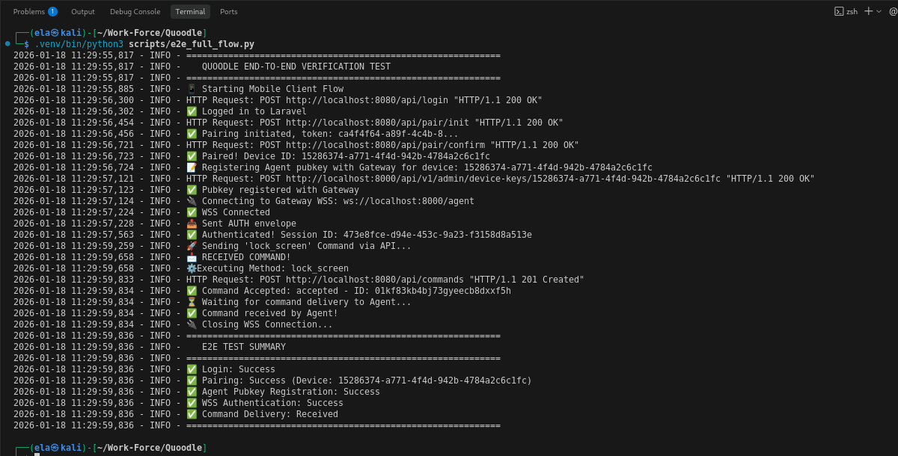

# 📘 **Quoodle**

### _Secure Device Control System • Research Sandbox_

> [!NOTE]
> **Status:** Active Development (Phases 1-3 Complete)
> **Latest Feature:** Full Docker Dev Stack & One-Click Setup

## 🧭 **Overview**



**Quoodle** is a cryptographically secure platform enabling mobile users to remotely monitor, manage, and control Windows devices. Designed for security research and academic simulation, it mimics enterprise MDM/EDR architectures with strict "Zero Trust" principles.

### **Core Components**

| Component                 | Role                                                                    | Tech Stack          |
| ------------------------- | ----------------------------------------------------------------------- | ------------------- |
| **quoodle-mobile-client** | User UI: Pairing, Telemetry, Command Issuance                           | Flutter             |
| **quoodle-control-plane** | Identity Provider (IdP), Policy Engine, Audit Log, Command Signing Authority | Laravel (PHP 8.2)   |
| **quoodle-gateway**       | Real-time WSS Hub, Telemetry Ingestion, Command Routing                 | FastAPI (Python 3.11)|
| **quoodle-agent-windows** | Device Agent: Connects to Gateway, Enforces Commands                    | C++23               |
| **quoodle-kernel-guard**  | Kernel Service: Privileged Execution, Anti-Tamper, IOCTL                | C / C++             |
| **quoodle-infra**         | Infrastructure: Docker, K8s, Terraform                                  | DevOps              |

---

## 🚀 **Quick Start (Developer)**

We provide a **One-Click** setup script to spin up the entire backend stack (Laravel, FastAPI, Redis, MySQL) using Docker Compose.

### **Prerequisites**
- Docker & Docker Compose
- Helper tools: `curl`, `openssl` (optional)

### **Run the Stack**

```bash
# 1. Run the setup script
./scripts/setup_dev.sh
```

This will:
1.  Check your environment.
2.  Generate necessary `.env` files.
3.  Build and start all containers via `docker-compose`.

**Access Points:**
- **Control Plane:** [http://localhost:8080](http://localhost:8080)
- **Gateway:** [http://localhost:8000](http://localhost:8000) (Health: `/health`)

---

## 🔒 **Security Features (Implemented)**

### **Phase 1: Security Hardening**
- **Fail-Secure Defaults**: Agent and Kernel default to strictly enforcing signature verification if configuration is missing.
- **Fail-Closed API**: Control Plane API requires JWT authentication for all command endpoints.
- **Explicit Logging**: Agent logs detailed cryptographic failure reasons (e.g., "Signature Invalid", "Key Missing") to aid debugging without compromising security.

### **Phase 2: Reliability & Persistence**
- **Telemetry Pipeline**: Gateway ingests device telemetry via Redis queues for persistence.
- **Exponential Backoff**: Agent implements jittered exponential backoff (1s -> 60s) for robust reconnection.
- **Production Checks**: Services warn aggressively if critical backing services (Redis) are missing in production mode.

---

## 📂 **Repository Structure**

```
Quoodle/
├── quoodle-control-plane/  # Laravel Backend
├── quoodle-gateway/        # FastAPI Gateway
├── quoodle-agent-windows/  # Windows Agent
├── quoodle-kernel-guard/   # Kernel Service
├── quoodle-mobile-client/  # Flutter App
├── quoodle-infra/          # Infrastructure Configs
├── docs/                   # Architecture, Specs, Protocols
├── scripts/                # Dev Automation Scripts
└── docker-compose.yml      # Root Orchestration
```

---

## 📚 **Documentation**

- **Architecture**: [docs/architecture/](docs/architecture/)
- **Specifications**: [docs/specs/](docs/specs/)
- **Onboarding**: [docs/onboarding/](docs/onboarding/)

## 🤝 **Contribution**
This is an academic research project. Code style is enforced via `clang-format` (C++), `black` (Python), and `pint` (PHP). See `docs/onboarding/contribution_guide.md`.
