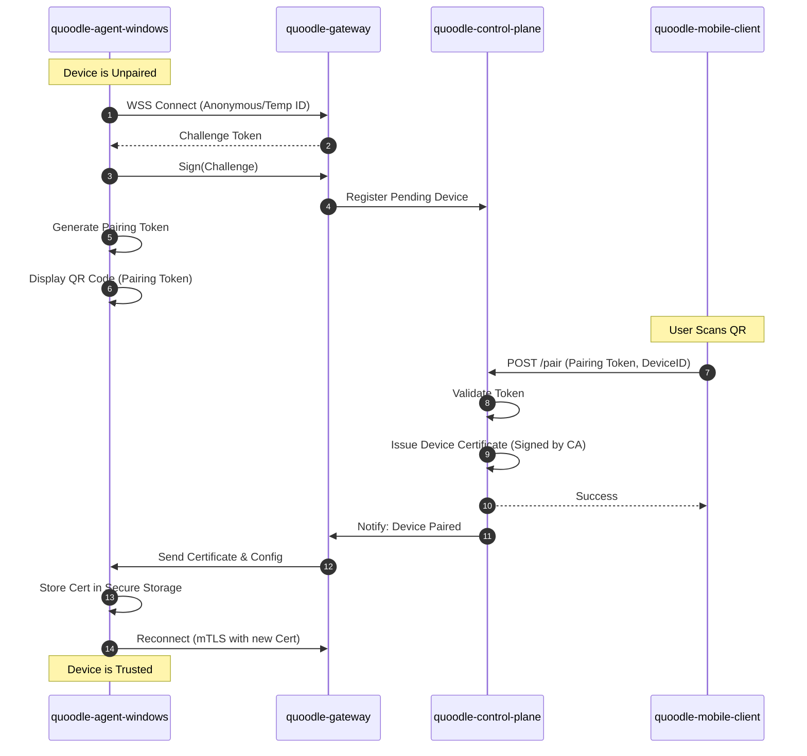
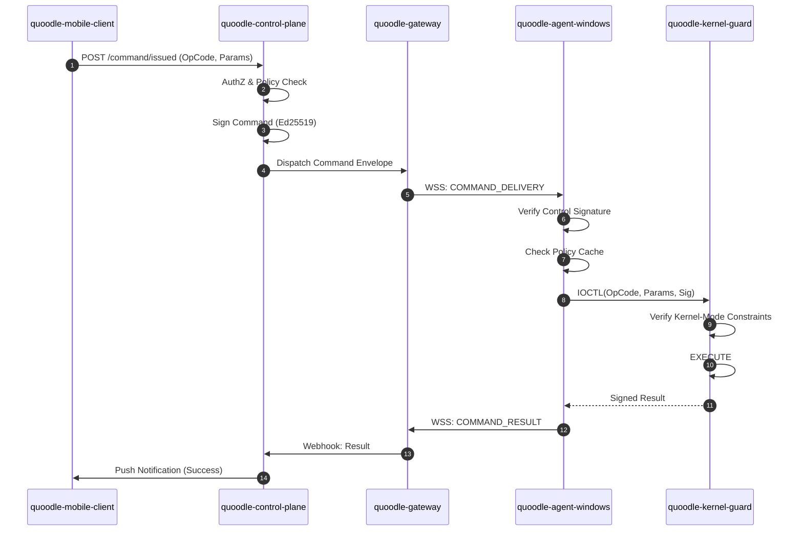

# 🔄 Sequence Flows

This document details the step-by-step logic for critical system operations.

## 1. Device Pairing (Trust Establishment)

The process of binding a raw `quoodle-agent-windows` to a `quoodle-mobile-client` user account.

---

## 2. Command Execution (Round Trip)

The path of a command from intent to verified execution.

