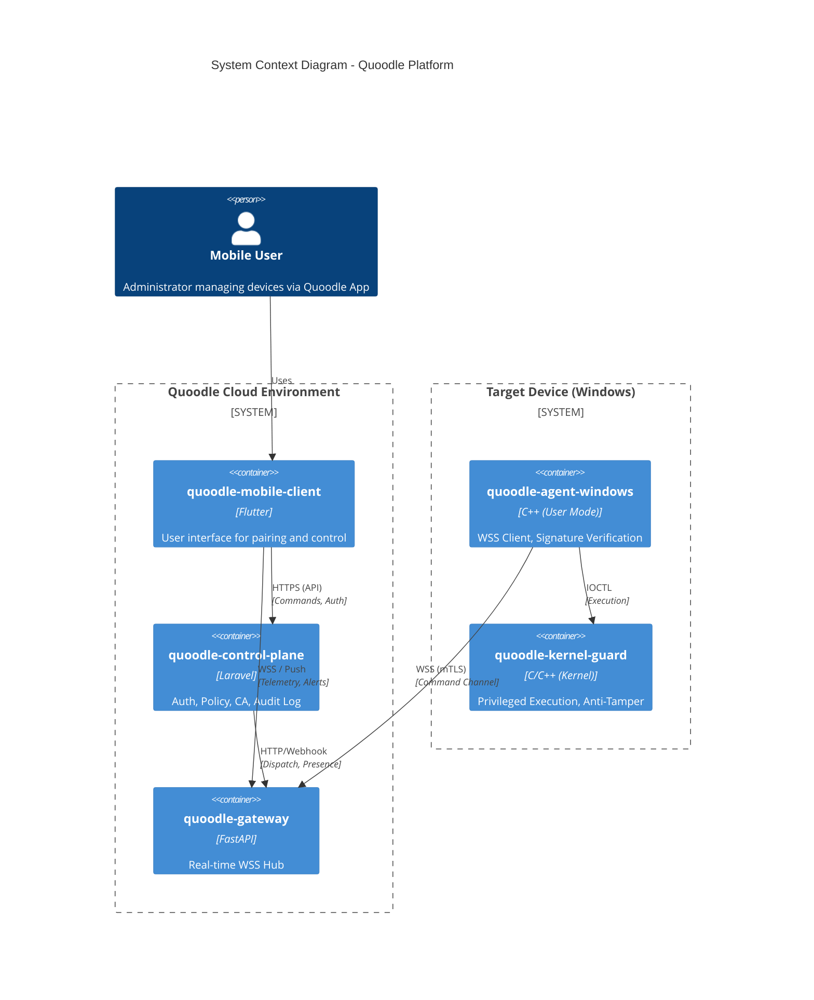
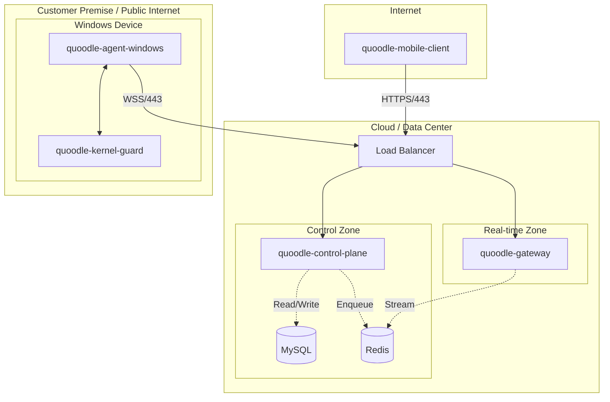

# 📊 System Diagrams

This document visualizes the core structural and deployment views of the Quoodle system.

## 1. System Context (Container View)

This high-level view shows how the five main components interact to form the Quoodle platform.

---

## 2. Network & Deployment View

